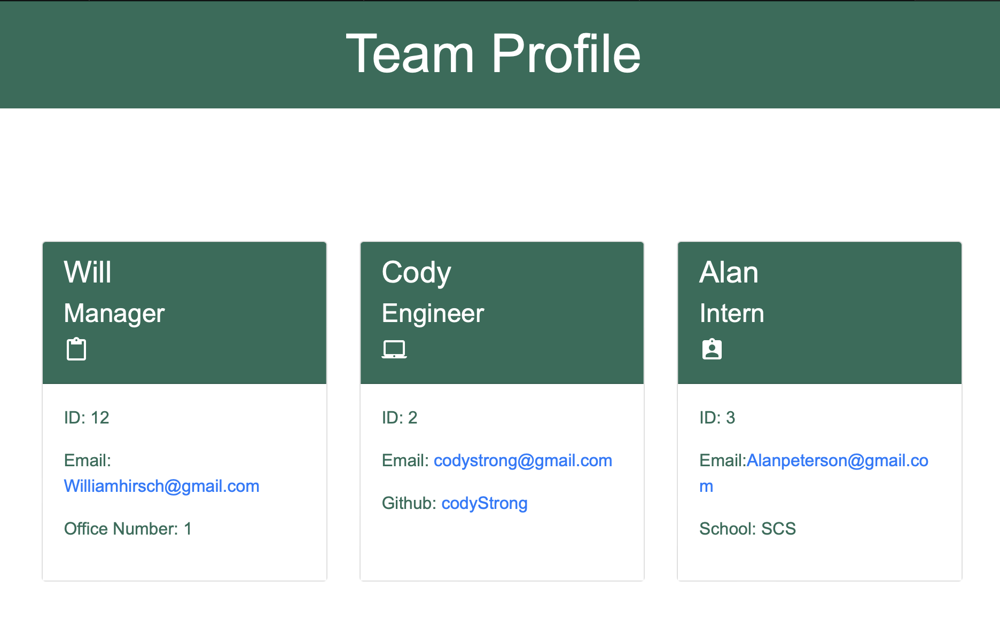

# Team-Profile-Generator
This Team profile generator was created to quickly input data about a person into the terminal to serve up as content for a html file.

## Installation
Clone this repository, Then open the terminal on script.js and run these comands in the following order, npm i, npm i node, node script.js. The appliction should prompt you to input information. After that go to the dist folder and open the html file.

## Usage
The usage is to serve as a quick application that can store data to be updated to a static html page.

## Screenshots

## License
MIT License
